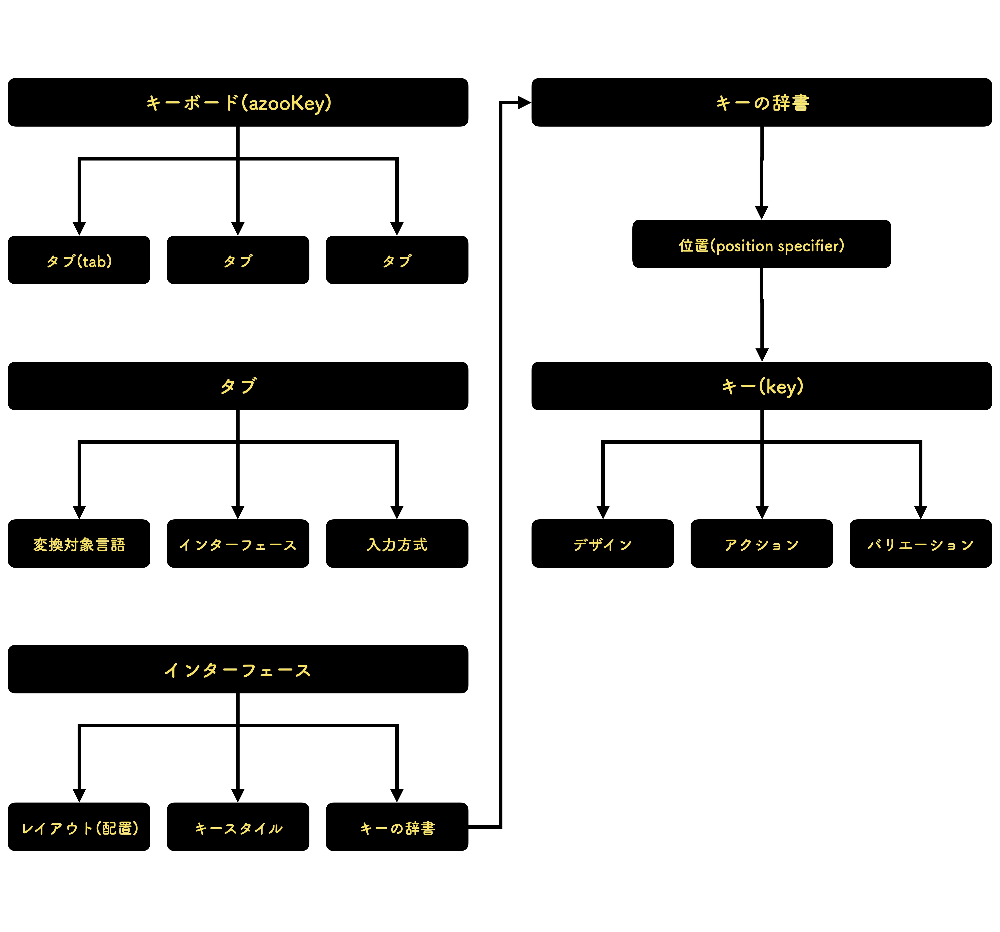

# CustardKit

azookeyのカスタムタブのデータファイルを作成するための補助ツールです。

現在以下を含みます。

* Swift向け生成ツール
* Python向け生成ツール
* JSON/Swift/Python用ドキュメント
  * [JSON用ドキュメント](./json/howToMake.md)
  * [Swift用ドキュメント](./swift/howToMake.md)
  * [Python用ドキュメント](./python/howToMake.md)

## Structure of a keyboard

azooKeyではキーボードの構造を以下の図のように捉えています。

カスタムタブのデータファイルは主にインターフェースを記述するものです。

## How to use generated file

1. [App Store](https://apps.apple.com/us/app/id1542709230)でazooKeyをインストールしてください。
2. 拡張→カスタムタブの管理→読み込む　より、作成したファイルを読み込んでください。
3. ファイルが読み込まれたら「保存」を押してください。
4. キーボード上で、何も入力していない状態で変換候補欄を長押しし、タブバーを表示してください。
5. 右にスクロールし、作成したファイルの名前をタップしてください。
6. カスタムタブが利用できます。

## Licence

MIT Licenceです。ご自由にご利用ください。