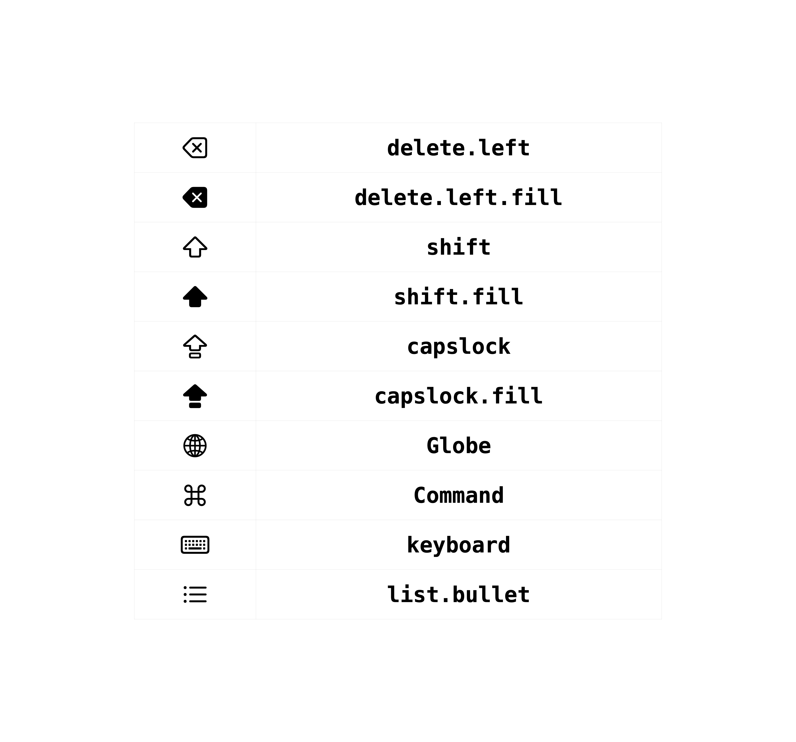

# Custardファイルの作り方

カスタードファイルはjson形式のデータです。拡張子は`txt`, `json`, `custard`のうちどれかである必要があります。

## キーの記述

キーボードでキーは最も大切な要素です。custardファイルではキーは次のように記述します。

```python
CustomKey(
    design = KeyDesign(
        label = TextLabel(text = "@#/&_"),
        color = KeyColor.normal
    ),
    press_actions = [
        InputAction("@")
    ],
    longpress_actions = LongpressAction(),
    variations = []
)
```

このデータは

* ラベルが「@#/&_」であり
* 色は普通のキーと同じであり
* 押すと「@」を入力し
* 長押ししても何もせず
* フリックや長押しによる候補変更は行われない

キーを表現しています。順番に見てみましょう。

### デザイン

最初の引数は`design`です。これは`KeyDesign`というオブジェクトで、キーのデザインを指定します。

```python
design = KeyDesign(
    label = TextLabel(text = "@#/&_"),
    color = KeyColor.normal
),
```

`label`はキーに表示されるラベルです。ラベルに指定できる値は次の通りです。

| オブジェクト     | 初期化の引数    | 説明                                                         |
| ---------------- | --------------- | ------------------------------------------------------------ |
| TextLabel        | text: str       | 指定した文字をラベルとして表示します。                       |
| MainAndSubLabel | main: str, sub: str | `main`に指定した1文字を1行目に大きめに、`sub`に指定した文字を2行目に小さめに表示します。 |
| SystemImageLabel | identifier: str | 指定した名前の画像をラベルとして表示します。指定できる値は以下の通りです。<br />この画像はSFSymbolsから取得されます。 |



`color`はキーの色です。azooKeyは着せ替えに対応しているため、キーの色は環境によって変わります。これは`KeyColor`という列挙型の値で、以下の値を指定できます。

| 識別子   | 説明                                     |
| -------- | ---------------------------------------- |
| normal   | 通常の入力キーの色です。                 |
| special  | タブ移動キーや削除キーの色です。         |
| selected | 選択中のタブや押されているキーの色です。 |
| unimportant | 重要度の低いキーの色です。 |

### アクション

次の引数は`press_actions`です。これはキーを単純に押した際のアクションの配列です。キーを押して離した段階で、配列の順序で動作が実行されます。

アクションは例えば以下のように記述されています。

```python
press_actions = [
    InputAction("@")
],
```

`InputAction` インスタンスは `text` メンバーで指定された文字列を入力するアクションを表します。

azooKeyでは`InputAction`の他にいくつかの動作を行うことができます。

| 関数                           | メンバー変数                                             | 挙動                                                         |
| :----------------------------- | :----------------------------------------------- | :----------------------------------------------------------- |
| InputAction                   | text: str                                        | 引数textを入力します                                         |
| DeleteAction                  | count: int                                       | (countの絶対値)文字を削除します。負の値が指定されている場合は文末方向に削除します。 |
| MoveCursorAction             | count: int                                       | (countの絶対値)文字分カーソルを移動します。負の値が指定されている場合は文頭方向に移動します。 |
| MoveTabAction               | tab_type: TabType<br />identifier: str           | identifierで指定したタブに移動します。tab_typeが`system`の場合はazooKeyが標準で搭載しているタブに移動し、`custom`の場合はidentifierを持ったカスタムタブに移動します。システムタブとして指定できる値は後に記述します。 |
| SelectCandidateAction       | type: str<br /> value: int          | 引数で指定した候補を選択状態にします。typeは4種類あります。`"first"`（最初の候補）と`"last"`（最後の候補）の場合は`"value"`の指定は不要です。`"exact"`（value個目の候補を選択）と`"offset"`（value個隣の候補を選択）の場合は`"value"`に数値を指定してください。 |
| CompleteAction               | なし                                             | 変換を確定します                                                          |
| ReplaceLastCharactersAction | table: {str: str}                                | カーソル文頭方向の文字列を引数のtableに基づいて置換します。例えばカーソル文頭方向の文字列が`"abcdef"`であり、テーブルに`"def":":="`が指定されている場合は`"abc:="`と置換されます。 |
| ReplaceDefaultAction         | なし                                             | azooKeyが標準で用いている「濁点・半濁点・小書き・大文字・小文字」の切り替えアクションです。 |
| SmartDeleteAction            | direction: ScanDirection<br />targets: list[str] | directionに`ScanDirection.forward`または`ScanDirection.backward`を指定します。targetsに指定した文字のいずれかがカーソル進行方向に現れるまで削除を繰り返します。例えば文頭方向の文字列が`"Yes, it is"`であり、`direction = ScanDirection.backward, target = [","]`であった場合、この操作の実行後に`" it is"`が削除されます。 |
| SmartDeleteDefaultAction    | なし                                             | azooKeyが標準で用いている「文頭まで削除」のアクションです。  |
| SmartMoveCursorAction       | direction: ScanDirection<br />target: list[str]  | directionに`ScanDirection.forward`または`ScanDirection.backward`を指定します。targetsに指定した文字のいずれかがカーソル進行方向に現れるまでカーソルの移動を繰り返します。例えば文頭方向の文字列が`"Yes, it is"`であり、`direction = ScanDirection.backward, target = [","]`であった場合、この操作の実行後にカーソルが`"Yes,| it is"`まで移動します。 |
| EnableResizingModeAction    | なし                                             | 片手モードの編集状態に移動します。編集状態ではキー操作などが行えないため、disable_resizing_modeは用意されていません。 |
| ToggleCursorBarAction       | なし                                             | カーソルバーの表示をtoggleします。                           |
| ToggleTabBarAction          | なし                                             | タブバーの表示をtoggleします。                               |
| ToggleCapsLockStateAction  | なし                                             | caps lockをtoggleします。                                    |
| DismissKeyboardAction        | なし                                             | キーボードを閉じます。                                       |
| PasteKeyboardAction        | なし                                             | コピーしている文字列をペーストします。フルアクセスがない場合動作しません。                                       |
| LaunchApplicationAction      | scheme_type: Literal['azooKey', 'shortcuts']<br />target: str | scheme_typeで指定されたアプリケーションをscheme://(target)として開きます。scheme_typeには`"azooKey"`か`"shortcuts"`のみを指定できます。 |

続く引数の`longpress_actions`は`LongpressAction`というオブジェクトで、ほぼ`press_actions`と同じです。

```python
class LongpressAction(object):
    def __init__(self, start: list[Action] = [], repeat: list[Action] = []):
        self.start = start
        self.repeat = repeat
```

ここで`start`は長押しの開始時に一度だけ実行される動作、`repeat`は長押しの間繰り返し実行される動作です。それぞれ上で書いたものと同様にアクションの配列を指定します。

#### システムタブ

以下を文字列で指定してください。

| 識別子              | 説明                                                         |
| ------------------- | ------------------------------------------------------------ |
| user_japanese       | ユーザの設定に合わせた日本語タブ                             |
| user_english        | ユーザの設定に合わせた英語タブ                               |
| flick_japanese      | フリック入力の日本語タブ                                     |
| flick_english       | フリック入力の英語タブ                                       |
| flick_numbersymbols | フリック入力の数字・記号タブ                                 |
| qwerty_japanese[^2] | ローマ字入力の日本語タブ                                     |
| qwerty_english[^2]  | ローマ字入力の英語タブ                                       |
| qwerty_number[^2]   | ローマ字入力の数字タブ                                       |
| qwerty_symbols[^2]  | ローマ字入力の記号タブ                                       |
| emoji_tab           | 絵文字タブ                                                |
| clipboard_history_tab | クリップボードの履歴タブ(フルアクセスが必要です)               |
| last_tab            | このタブの前のタブ<br />もしも履歴がない場合、現在のタブの指定になります |

### バリエーション

バリエーションは「メインとなるキーに付随して選択可能な別種のキー」のことです。簡単にはフリック入力における上下左右に現れるキー、あるいはローマ字入力において長押しで選択できる候補のことを指しています。`variations`には`VariationData`というオブジェクトの配列を指定します。

上のキーではバリエーションは指定していませんが、実際にバリエーションを作る際は次のように書きます。

```python
variations = [
    FlickVariationData(
        direction = FlickDirection.left,
        key = Variation(
            design = VariationDesign(
                label = TextLabel(text = "#"),
            ),
            press_actions = [
                InputAction("#")
            ],
            longpress_actions = LongpressAction()
        )
    ),
    FlickVariationData(
        direction = FlickDirection.top,
        key = Variation(
            design = VariationDesign(
                label = TextLabel(text = "/"),
            ),
            press_actions = [
                InputAction("/")
            ],
            longpress_actions = LongpressAction()
        )
    ),
]
```

少し長いですが、中身はここまでみてきたキーとほぼ変わりません。違いは

* 型が`FlickVariationData`であり
* デザインの指定がラベルのみであり
* `variations`の指定がなく
* `direction`の指定がある

ことです。

バリエーションはその出現する条件によって異なる型で表現されます。

| オブジェクト               | 必要な引数                                    | 説明                                                         |
| -------------------------- | --------------------------------------------- | ------------------------------------------------------------ |
| FlickVariationData         | direction: FlickDirection<br />key: Variation | `direction`として指定する`left,top,right,bottom`の方向のフリックで表示されるバリエーションです。 |
| LongpressVariationData[^3] | key: Variation                                | qwertyキーボードなどで見られる長押しして表示される候補のバリエーションです。配列に指定した順に表示されます。<br />これが指定されている場合、キーの`longpress_actions`に指定した値は無視されます。またバリエーションの`longpress_actions`は現状無効です。 |

以上でキーの記述の説明は終わりです。

## インターフェースの記述

インターフェースとはキーを含む画面全体のことです。例えば以下のような形をしています。

```python
Interface(
    key_layout = GridFitLayout(row_count = 2, column_count = 2),
    key_style = KeyStyle.tenkey_style,
    keys = [
        KeyData(
            specifier = GridFitSpecifier(x = 0, y = 1),
            key = {キーのデータ}
        ),
        (省略)
    ]    
)
```

### レイアウト

`key_layout`とはキーを配置する方法です。`Layout`オブジェクトを指定します。指定できるのは以下の二つの値です。

| オブジェクト     | 引数                                                         | 説明                                                         |
| ---------------- | ------------------------------------------------------------ | ------------------------------------------------------------ |
| GridFitLayout    | row_count: int<br />column_count: int                        | 画面全体に収まるように格子状にキーを配置するレイアウトです。横にrow_count個、縦にcolumn_count個のキーを並べます。 |
| GridScrollLayout | direction: ScrollDirection<br />row_count: float<br />column_count: float | 画面をスクロールできる状態にして格子状にキーを配置するレイアウトです。<br />スクロールの方向を示すdirectionには`ScrollDirection.vertical`または`ScrollDirection.horizontal`を指定し、row_countとcolumn_countを指定します。<br />スクロール方向に垂直な向きのキー数は切り捨てて整数として利用されますが、平行な向きのキー数は小数のまま用います。<br />このレイアウトが指定されている場合、キーの`variations`は一切無効になります。 |

### スタイル

引数`key_style`は`KeyStyle`型で、処理系にどのようにキーを扱えばいいかを知らせるための値です。`tenkey_style`または`pc_style`を指定してください。

片手モードの状態は端末の向きとスタイルによって決まります。レイアウトが`grid_scroll`である場合はフリック操作とサジェストは無効化されます。

| スタイル     | 説明                                                         |
| ------------ | ------------------------------------------------------------ |
| tenkey_style | 携帯打ちやフリック式のかな入力、九宮格輸入法などで用いられる、10キーを模した形状のキーボードに対して指定してください。<br />variationはflick_variationのみが有効になります。<br />縦方向のスペーシングは狭めになります。<br />サジェストはキーを長押しすると表示され、キーとflick_variationが表示されます。 |
| pc_style     | Qwerty配列やJisかな配列など、パソコンのキーボードを模した形状のキーボードに対して指定してください。<br />variationはlongpress_variationのみが有効になります。<br />縦方向のスペーシングは広めになります。<br />サジェストはキーを押すと表示され、押し続けるとlongpress_variationが表示されます。 |

### キー

`keys`とは`KeyData`というオブジェクトの配列です。ここには以下のような形のオブジェクトが入ります。

```python
 KeyData(
      specifier = GridFitSpecifier(x = 0, y = 1),
      key = CustomKey(...)
)
```

引数`specifier`はキーの位置を調整するために必要な値です。指定できる値は次の2種類です。

| オブジェクト        | 引数                                                        | 説明                                                         |
| ------------------- | ----------------------------------------------------------- | ------------------------------------------------------------ |
| GridFitSpecifier    | x: int<br />y: int<br />width: int = 1<br />height: int = 1 | grid_fitレイアウト上でキーをどの位置に配置するかを指定します。<br />キーの左上が(x, y)となり、widthとheightの分だけ縦横に広がります。<br />widthとheightは省略可能です。 |
| GridScrollSpecifier | index: int                                                  | grid_scrollレイアウト上で最初から数えた順番を指定します。<br />0から順に指定し、間を開けてはいけません。 |

以下は例です。

```python
#grid_fitの場合
specifier = GridFitSpecifier(x = 0, y = 1)

#grid_scrollの場合
specifier = GridScrollSpecifier(index = 42)
```

`key`はキーの実体を指定する値で、`SystemKey`または`CustomKey`を指定します。`Customkey`は上で確認したキーのデータです。

`SystemKey`は特殊なキーを指定するための値です。引数の`identifier`は`SystemKeyType`という列挙型で指定します。以下から指定してください。

| 識別子            | 説明                                                         |
| ----------------- | ------------------------------------------------------------ |
| change_keyboard   | 地球儀キー(キーボード切り替えキー)。ホームボタンがない端末ではカーソルバーの表示キーに切り替わります。ホームボタンがない端末ではカーソルバーの表示キーに切り替わります。 |
| enter             | 改行・確定キー。                                             |
| upper_lower       | 大文字・小文字キー。                                          |
| next_candidate    | 入力状態に応じて「空白」と「次候補」が切り替わるキー。               |
| flick_kogaki      | ユーザがカスタムしている可能性のあるフリックの「小ﾞﾟ」キー。grid_fitのtenkey_style以外での利用は非推奨。 |
| flick_kutoten     | ユーザがカスタムしている可能性のあるフリックの「､｡?!」キー。grid_fitのtenkey_style以外での利用は非推奨。 |
| flick_hira_tab    | ユーザがカスタムしている可能性のあるフリックの「あいう」キー。grid_fitのtenkey_style以外での利用は非推奨。 |
| flick_abc_tab     | ユーザがカスタムしている可能性のあるフリックの「abc」キー。grid_fitのtenkey_style以外での利用は非推奨。 |
| flick_star123_tab | ユーザがカスタムしている可能性のあるフリックの「☆123」キー。grid_fitのtenkey_style以外での利用は非推奨。 |

以上でインターフェースの記述の説明は終わりです。

## カスタードの記述

あと少しです！カスタードは以下のように記述します。

```python
Custard(
  identifier = "my_flick",
  language = Language.ja_JP,
  input_style = InputStyle.direct,
  metadata = MetaData(custard_version = "1.0", display_name = "私のフリック"),
  interface = {インターフェースの記述}
)
```

`identifier`はカスタードを識別するための文字列です。他のものと被らない値を指定してください。

`language`は`Language`という列挙型で、変換対象の言語です。以下の値が指定できます。

| 識別子    | 説明                                                 |
| --------- | ---------------------------------------------------- |
| ja_JP     | 日本語(共通語)                                       |
| en_US     | 英語(アメリカ)                                       |
| el_GR     | ギリシャ語                                           |
| undefined | 指定なし。変換候補は出るので記号などの入力で用いる。 |
| none      | 変換なし。                                           |

`input_style`は`InputStyle`という列挙型で、入力方式です。以下の値が指定できます。

| 識別子     | 説明                         |
| ---------- | ---------------------------- |
| direct     | 入力をそのまま用います。     |
| roman2kana | ローマ字かな入力を行います。 |

`metadata`は`Metadata`型の値で、キーボードの動作とは無関係な情報を格納します。現在は以下の2つの値を指定してください。

* `custard_version`は規格のバージョン情報です。この資料に基づいて作成する場合`"1.0"`を指定してください。
* `display_name`はタブバーなどでデフォルトで用いられる名称です。

`interface`には上で記述したとおりのインターフェースの記述を行います。

### 複数のカスタードファイルを1つにまとめる

カスタードのデータを配列で指定することで、読み込み側が複数のファイルを一括で読み込めます。

```Python
custards = [
  {カスタードの記述1},
  {カスタードの記述2},
  {カスタードの記述3},
]
```

以上でカスタードの記述の説明は終わりです。

## ツール

特定の状況でより簡単に記述するため、ユーティリティが用意されています。

### キーの作成

以下の2つの関数が用意されています。

```python
CustomKey.flickSimpleInputs(center: str, subs: list[str], centerLabel: str = None) -> CustomKey

CustomKey.flickSimpleInputAndLabels(center: Union[tuple[str, str], str], left: Union[tuple[str, str], str, None] = None, top: Union[tuple[str, str], str, None] = None, right: Union[tuple[str, str], str, None] = None, bottom: Union[tuple[str, str], str, None] = None) -> CustomKey
```

`CustomKey.flickSimpleInputs`では、中心の文字とフリックで入力する文字を順番に指定することで`CustomKey`オブジェクトを作成します。以下のように用いることができます。

```python
key = CustomKey.flickSimpleInputs(center = "あ", subs = ["い", "う", "え", "お"], centerLabel = "あいう")
```

`CustomKey.flickSimpleInputAndLabels`では、フリックで入力する文字にもラベルを指定することができます。以下のように用いることができます。

```python
key = CustomKey.flickSimpleInputAndLab(
    center = ("😸", ":smile_cat:"), 
    left = ("😿", ":crying_cat_face:"),
    right = ("😻", ":heart_eyes_cat:"),
)
```

この関数では、ラベルと入力が同じ場合に指定を省略することができます。

```python
key = CustomKey.flickSimpleInputAndLab(
    center = ("あ", "あ゛"), 
    left = ("い", "い゛"),
    top = "ゔ",
    right = ("え", "え゛"),
    bottom = ("お", "お゛")
)
```

### 書き出し

書き出しのための関数が用意されています。

```python
#指定したpathにcustardファイルを書き出します
custard.write(to = path)

#resultディレクトリ内に指定した名前でcustardファイルを書き出します
custard.write(name = path)

#resultディレクトリ内に指定した名前で上書きを許可しながらcustardファイルを書き出します
custard.write(name = path, allow_overwrite = True)
```

複数のCustardオブジェクトを1つのファイルとして書き出す場合は`CustardList`オブジェクトに包みます。書き出しはCustardオブジェクトと同様に行うことができます。

```python
custardList = CustardList([custard1, custard2, custard3])

#指定したpathにcustardのリストのファイルを書き出します
custardList.write(to = path)
```

## 用例

例としてUnicodeに登録されているヒエログリフを入力できるスクロール可能なタブを作りましょう。

```python
from source.custard import *
#ヒエログリフの文字のリストを取得
hieroglyphs = list(map(lambda x: chr(x), range(0x13000, 0x133FF+1)))

#キーのリストを作成
hieroglyphs_keys = [
    KeyData(
        specifier = GridScrollSpecifier(index = 0),
        key = SystemKey(SystemKeyType.change_keyboard)
    ),
    KeyData(
        specifier = GridScrollSpecifier(index = 1),
        key = CustomKey(
            design = KeyDesign(
                label = TextLabel(text = "←"),
                color = KeyColor.special
            ),
            press_actions = [
                MoveCursorAction(-1)
            ],
            longpress_actions = LongpressAction(
                repeat = [
                    MoveCursorAction(-1)
			    ]
            ),
            variations = []
        )
    ),
    KeyData(
        specifier = GridScrollSpecifier(index = 2),
        key = CustomKey(
            design = KeyDesign(
                label = TextLabel(text = "→"),
                color = KeyColor.special
            ),
            press_actions = [
                MoveCursorAction(1)
            ],
            longpress_actions = LongpressAction(
                repeat = [
                    MoveCursorAction(1)
                ]
            ),
            variations = []
        )
    ),
    KeyData(
        specifier = GridScrollSpecifier(index = 3),
        key = CustomKey(
            design = KeyDesign(
                label = SystemImageLabel(identifier = "list.bullet"),
                color = KeyColor.special
            ),
            press_actions = [
                ToggleTabBarAction()
            ],
            longpress_actions = LongpressAction(),
            variations = []
        )
    ),
    KeyData(
        specifier = GridScrollSpecifier(index = 4),
        key = CustomKey(
            design = KeyDesign(
                label = SystemImageLabel(identifier = "delete.left"),
                color = KeyColor.special
            ),
            press_actions = [
                DeleteAction(1)
            ],
            longpress_actions = LongpressAction(
                repeat = [
                    MoveCursorAction(1)
                ]
            ),
          	variations = []
        )
    ),
]

for glyph in hieroglyphs:
    key = CustomKey(
        design = KeyDesign(
            label = TextLabel(text = glyph),
            color = KeyColor.normal
        ),
        press_actions = [
            InputAction(glyph)
        ],
        longpress_actions = LongpressAction(),
        variations = []
    )
    keydata = KeyData(
        specifier = GridScrollSpecifier(index = len(hieroglyphs_keys)),
        key = key
    )
    hieroglyphs_keys.append(keydata)
      
#カスタードオブジェクトを作成
hieroglyphs_custard = Custard(
    identifier = "Hieroglyphs",
    language = Language.none,
    input_style = InputStyle.direct,
    metadata = Metadata(
        custard_version = "1.0",
        display_name = "ヒエログリフ",
    ),
    interface = Interface(
        key_style = KeyStyle.tenkey_style,
        key_layout = GridScrollLayout(direction = ScrollDirection.vertical, row_count = 8, column_count = 4.2),
        keys = hieroglyphs_keys
    )
)
hieroglyphs_custard.write(to = "hieroglyphs.json")
```

---

[^2]: ここではpc_styleではなくqwertyと呼んでいます。これはこのタブの配列がqwertyであるからです。
[^3]:  ここではqwerty_variationあるいはpc_style_variationではなくlongpress_variationと呼んでいます。variationがそれが現れる条件となる操作によって分類されるからです。

